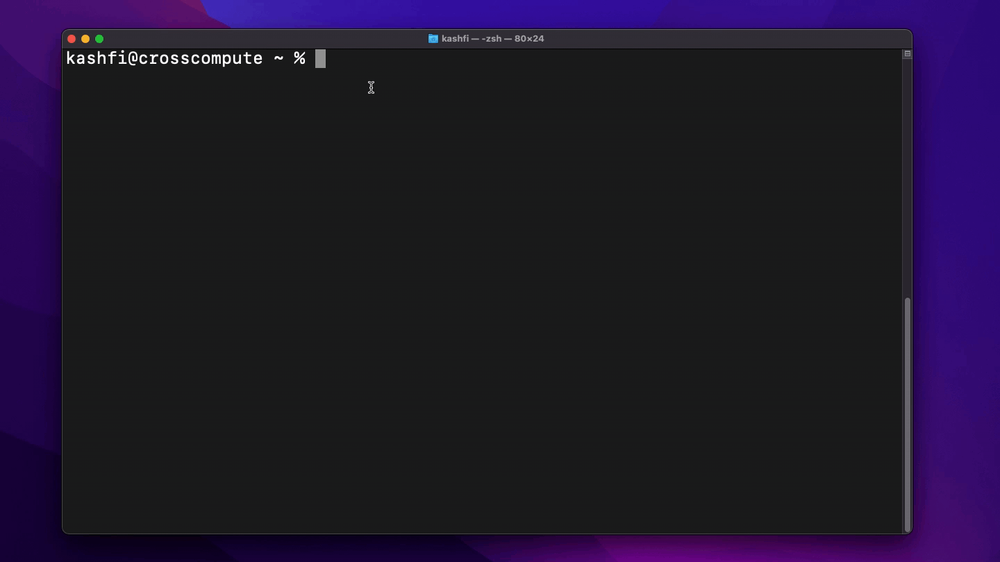
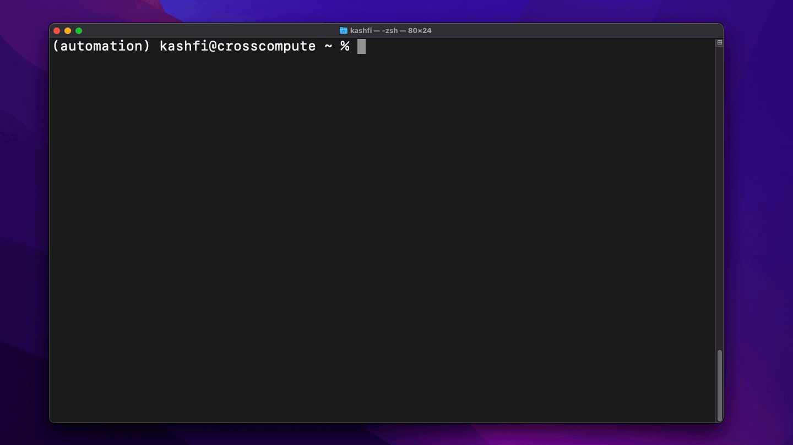

# Title of Tutorial

You have an idea.  You get your pen and your paper to take down that idea and put it on paper.  You then take your idea on paper, you head to your machine. At your machine, you work line after line, funtions after functions, tests after tests, that idea from your head, to your paper, is now on your machine. You run your code. You solve a problem. The program But now your tool just sits on your machine, it waits for you to run it, it waits for you to give it some inputs, it waits to solve a problem and return to the world the solution. 

## Section 1: Introduction to the simulation

## Section 2: Setting up your vevn

### What is venv? So what? How to make one?

## Section 3: Identifying input and output

### Reviewing the modeling script: 
### What libraries will we need? Set up a setup.sh file to install all the dependencies
### Once we have our input-output create the data.dictionary file. It's going to store the user input/interactivity
### Do the same for the outputs

## Section 4: Configuring the automate.yml file

## Section 5: crosscompute automate.yml